# GitHub Repository Explorer 🚀


## Overview

GitHub Repository Explorer is an enterprise-grade web application implementing advanced repository discovery and analysis capabilities through the GitHub API. Built with modern web standards and progressive enhancement principles, it provides a sophisticated interface for exploring GitHub's vast ecosystem of repositories.

## ✨ Features

### Frontend Architecture

<p align="center">
  
</p>

The above diagram illustrates the core architecture of the GitHub Random Repository Explorer application. It shows the relationships between different components and the flow of data through the system.

### Core Functionality
- **Smart Repository Discovery**: Fetch trending repositories by programming language
- **Intelligent Caching**: Browser-based caching system using IndexedDB
- **Rate Limit Management**: Sophisticated GitHub API rate limit handling
- **Responsive Design**: Glass-morphic UI that adapts to any screen size

### Technical Highlights
```javascript
// Example of our advanced caching implementation
async saveToIndexedDB(storeName, data) {
    return new Promise((resolve, reject) => {
      const transaction = this.db.transaction([storeName], "readwrite");
      const store = transaction.objectStore(storeName);
      const request = store.put(data);

      request.onsuccess = () => resolve();
      request.onerror = () => reject(new Error("Failed to save to IndexedDB"));
    });
  }

  async loadFromIndexedDB(storeName, key) {
    return new Promise((resolve, reject) => {
      const transaction = this.db.transaction([storeName], "readonly");
      const store = transaction.objectStore(storeName);
      const request = store.get(key);

      request.onsuccess = () => resolve(request.result);
      request.onerror = () =>
        reject(new Error("Failed to load from IndexedDB"));
    });
  }

  async updateCache(language, data) {
    // Update the cache memory
    this.state.repositoryCache.set(language, data);
    await this.saveToIndexedDB("repositories", { language, ...data });

    if (this.state.repositoryCache.size > this.state.settings.MAX_CACHE_SIZE) {
      const oldestKey = this.state.repositoryCache.keys().next().value;
      this.state.repositoryCache.delete(oldestKey);
    }

    await this.saveToIndexedDB("analytics", {
      timestamp: Date.now(),
      action: "cache_update",
      language,
      cacheSize: this.state.repositoryCache.size,
    });
  }

  async checkCacheExpiration() {
    try {
      // Get all stored repositories from IndexedDB
      const transaction = this.db.transaction(["repositories"]);
      const store = transaction.objectStore("repositories");
      const request = store.getAll();

      request.onsuccess = async () => {
        const repositories = request.result;
        const expiredRepositories = [];

        // Check each repository's timestamp
        repositories.forEach((repo) => {
          if (this.isCacheExpired(repo.timestamp)) {
            expiredRepositories.push(repo.language);
            this.state.repositoryCache.delete(repo.language);
          }
        });

        // Remove expired entries from IndexedDB
        if (expiredRepositories.length > 0) {
          const deleteTransaction = this.db.transaction(
            ["repositories"],
            "readwrite"
          );
          const deleteStore = deleteTransaction.objectStore("repositories");

          expiredRepositories.forEach((language) => {
            deleteStore.delete(language);
          });

          // Log cache cleanup analytics
          await this.saveToIndexedDB("analytics", {
            timestamp: Date.now(),
            action: "cache_cleanup",
            expiredEntries: expiredRepositories.length,
            languages: expiredRepositories,
          });

          // If current language's cache was expired, trigger a prefetch
          if (
            this.state.currentLanguage &&
            expiredRepositories.includes(this.state.currentLanguage)
          ) {
            this.prefetchRepositories(this.state.currentLanguage);
          }
        }
      };

      request.onerror = () => {
        console.warn("Failed to check cache expiration:", request.error);
      };
    } catch (error) {
      console.warn("Error during cache expiration check:", error);
    }
  }
```

## 🛠 Technical Stack

### Core Technologies
- **HTML5**
  - Semantic markup
  - Custom data attributes
  - WAI-ARIA compliance

- **CSS3**
  - Custom properties (variables)
  - Glass-morphism effects
  - Grid/Flexbox layouts
  - Advanced animations
  - Media queries

- **Vanilla JavaScript**
  - ES6+ features
  - Async/Await patterns
  - IndexedDB integration
  - Custom event handling

## 📦 Project Structure

```plaintext
Github-random-repository entry point
├── styles/
│   ├── main.css              # Core styles
│   ├── components/           # Component-specific styles
│   └── utilities/            # Utility classes
├── js/
│   ├── app.js               # Application entry
│   ├── api/                 
│   ├── config/  
|   ├── services/
|   ├── ui/           
│   └── utils/              
```

## 🚀 Getting Started

1. **Clone the Repository**
```bash
git clone https://github.com/yourusername/github-repo-explorer.git
cd github-repo-explorer
```

2. **Launch the Application**
- Option 1: Use a development server
```bash
npx serve
```
- Option 2: Open index.html directly in a browser

## 🎨 UI Components

### Glass-morphic Card Component
```css
.repository-card {
  background: rgba(45, 51, 59, 0.6);
  backdrop-filter: saturate(180%) blur(10px);
  border: 1px solid rgba(68, 76, 86, 0.6);
  border-radius: 16px;
  transition: transform 0.3s cubic-bezier(0.4, 0, 0.2, 1);
}

.repository-card:hover {
  transform: translateY(-4px);
  box-shadow: 0 8px 32px rgba(0, 0, 0, 0.2);
}
```

## ⚡ Performance Optimizations

- **Minimal Dependencies**: Zero external libraries
- **Efficient DOM Operations**: Using DocumentFragment
- **Smart Caching**: IndexedDB with TTL
- **Lazy Loading**: On-demand data fetching
- **CSS Containment**: Layout optimization

## 🔧 Browser Support

| Browser | Minimum Version |
|---------|----------------|
| Chrome  | 70+            |
| Firefox | 65+            |
| Safari  | 12.1+          |
| Edge    | 79+            |

## 📊 Performance Metrics

| Metric                | Target | Current |
|----------------------|--------|----------|
| Largest Contentful Paint| <1s    | 0.731s     |
| Time to Interactive   | <2s    | 1.7s     |
| Lighthouse Score     | >90    |     71   |
| Bundle Size          | <100KB | 87KB     |

## 🤝 Contributing
### Development workflow

1. Fork the repository
2. Create your feature branch: `git checkout -b feature/amazing-feature`
3. Commit your changes: `git commit -m 'Add amazing feature'`
4. Push to the branch: `git push origin feature/amazing-feature`
5. Open a Pull Request

### Commit Convention
```
<type>(<scope>): <subject>

[optional body]

[optional footer(s)]
```

## 📝 Code Style Guide

### JavaScript
```javascript
// Use const for unchanging values
const API_BASE_URL = 'https://api.github.com';

// Async/await for promises
async function fetchRepository(language) {
  try {
    const response = await fetch(`${API_BASE_URL}/repos...`);
    return await response.json();
  } catch (error) {
    console.error('Failed to fetch:', error);
    throw error;
  }
}
```

### CSS
```css
/* Use custom properties for theming */
:root {
  --primary-color: #1a1d21;
  --accent-color: #539bf5;
  --transition: 0.3s cubic-bezier(0.4, 0, 0.2, 1);
}

/* Mobile-first approach */
.repository-card {
  width: 100%;
  padding: 1rem;
}

@media (min-width: 768px) {
  .repository-card {
    padding: 2rem;
  }
}
```

## 📄 License

This project is licensed under the MIT License - see the [LICENSE](LICENSE) file for details.

---

## 🙏 Acknowledgments

- GitHub API Documentation
- [roadmap.sh](https://roadmap.sh) project challenge [found here](https://roadmap.sh/projects/github-random-repo)

---
© 2024 GitHub Repository Explorer. Made with ❤️ without dependencies.